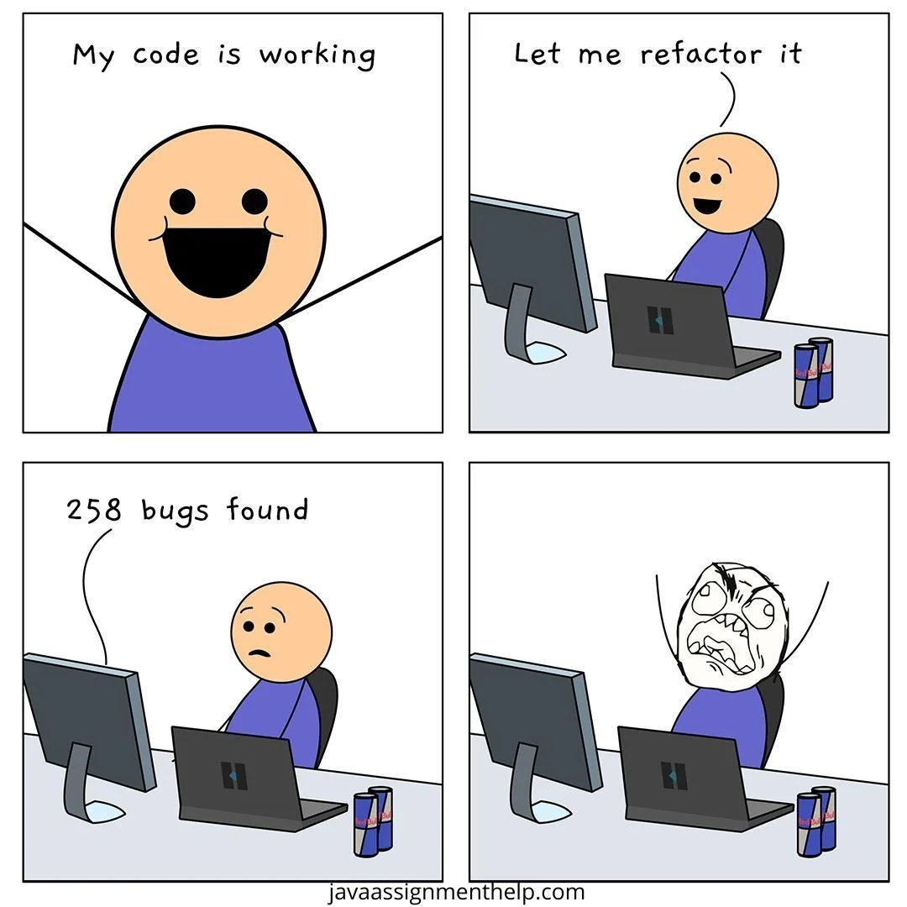

# 🌟 HelloWebsite

## 🚀 Описание проекта

**HelloWebsite** — это одностраничный сайт, созданный по макету, предоставленному в Figma.

## 📁 Структура проекта

helloWebsite/

    ├── index.html          # Основной HTML-файл страницы

    ├── css/                # Папка для CSS-стилей

        └── styles.css      # Основной файл стилей

        └── responsive.css  # (Опционально) Стили для адаптивности

    ├── js/                 # Папка для JavaScript-файлов

        └── scripts.js      # Основной файл скриптов

    ├── img/                # Папка для изображений

    ├── fonts/              # Папка для шрифтов

## ✨ Ключевые особенности

**Адаптивность**: cайт адаптирован под десктоп, планшет, мобильные устройства.

**БЭМ-методология**: для именования классов используется методология БЭМ.

**Кроссбраузерность**: верстка проверена в последних версиях Chrome, Safari, Firefox.

**Без фреймворков**: полная кастомизация без использования CSS-фреймворков.

## 🛠️ Установка и запуск

1. Склонируйте репозиторий:
    ```bash
    git clone https://github.com/alice-bal/helloWebsite.git
    ```
2. Перейдите в папку проекта:
    ```bash
    cd helloWebsite
    ```
3. Откройте `index.html` в вашем любимом браузере.

## 🛠️ Отправить в GIT

1. Создайте новый удаленный репозиторий.

2. Выполните команды:
```bash
git init                                                        # инициализация локальной репы
git remote add origin git@github.com:username/new-repo.git      # привязать удаленную репу
git remote -v                                                   # проверить
git checkout -b main                                            # переключиться на новую ветку
git add .                                                       # добавить новые файлы в коммит
git commit -m "v1"                                              # создать коммит
git push origin main                                            # отправить в репу

git remote remove origin                                        #удалить удаленную репу
```

## 📚 Ресурсы и ссылки

- **Дизайн в Figma**: [ссылка на макет](https://www.figma.com/design/agTi5OXOSYctGPPADHa6Sv/%D0%A2%D0%B5%D1%81%D1%82%D0%BE%D0%B2%D0%BE%D0%B5-%D0%B7%D0%B0%D0%B4%D0%B0%D0%BD%D0%B8%D0%B5?node-id=2837-23771&t=t0Ikh8xt7UPvsRjF-0)
- **Дополнительные материалы**:
  - [Руководство по БЭМ](https://ru.bem.info/methodology/)
  - [Документация по Flexbox](https://css-tricks.com/snippets/css/a-guide-to-flexbox/)
  - [Ридмики](https://github.com/GnuriaN/format-README)

## 🏅 Автор

Автор проекта: **Алиса**  
[Связаться со мной](alisa@expert27.ru)

---

> **Примечание**: Этот проект был создан в рамках тестового задания и демонстрирует способности автора в области верстки.

